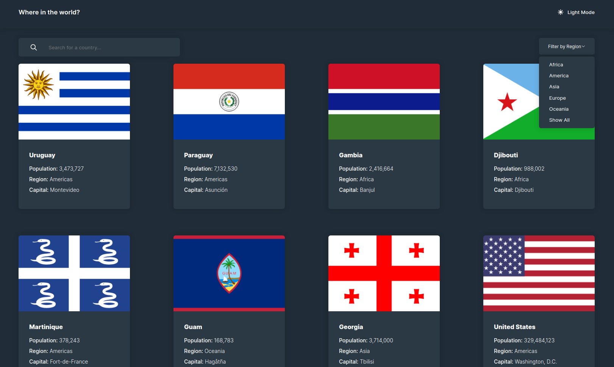
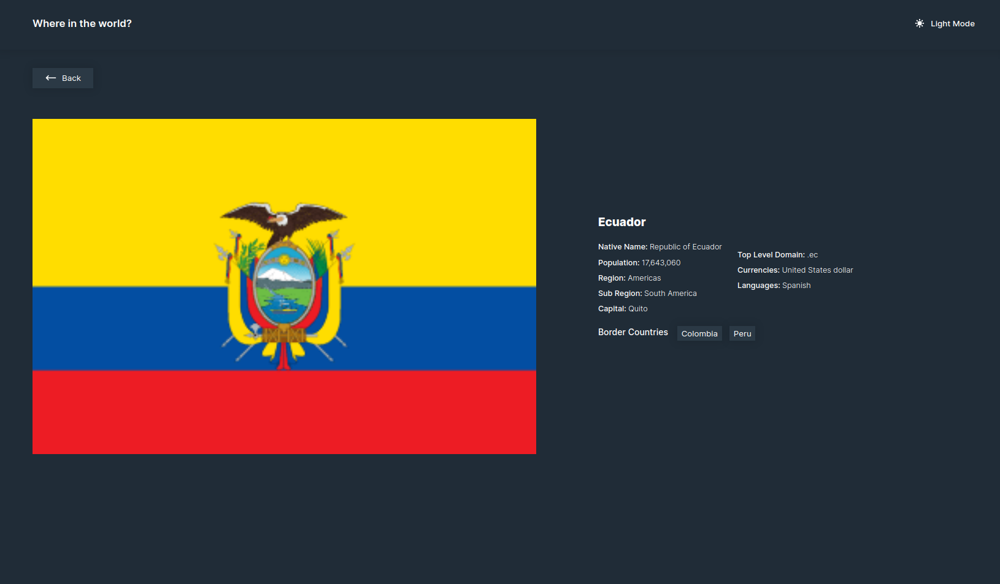
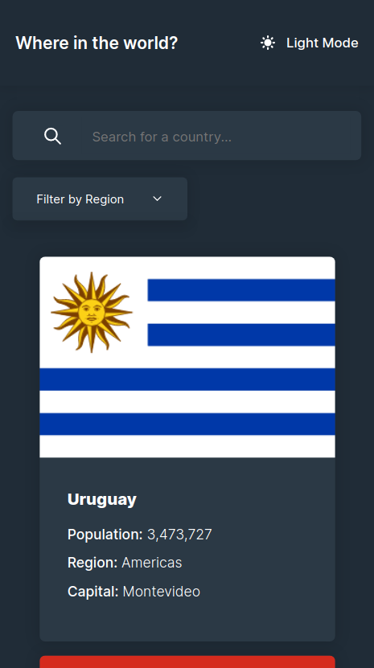
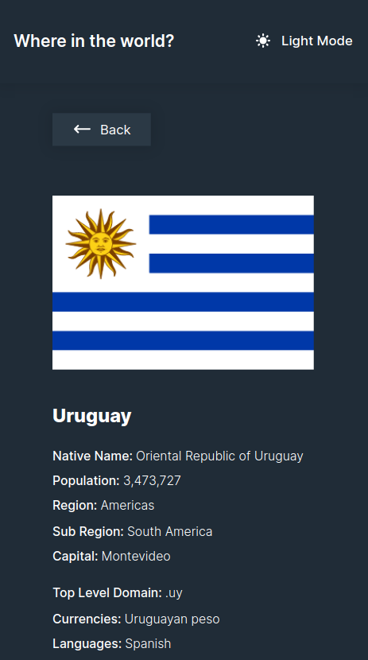
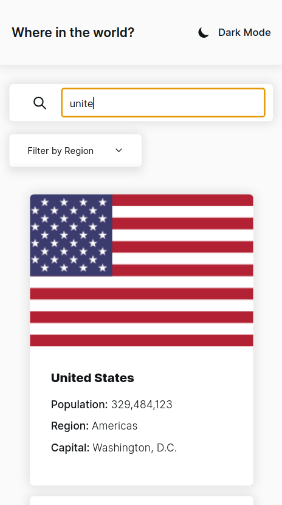

# Frontend Mentor - REST Countries API with color theme switcher solution

I have a creative block so I gave this a try. It was very fun!
This is a solution to the [REST Countries API with color theme switcher challenge on Frontend Mentor](https://www.frontendmentor.io/challenges/rest-countries-api-with-color-theme-switcher-5cacc469fec04111f7b848ca). Frontend Mentor challenges help you improve your coding skills by building realistic projects. 

## Table of contents

- [Overview](#overview)
  - [The challenge](#the-challenge)
  - [Screenshot](#screenshot)
  - [Links](#links)
- [My process](#my-process)
  - [Built with](#built-with)
  - [What I learned](#what-i-learned)
  - [Continued development](#continued-development)
  - [Useful resources](#useful-resources)
- [Author](#author)

## Overview

### The challenge

Users should be able to:

- See all countries from the API on the homepage
- Search for a country using an `input` field
- Filter countries by region
- Click on a country to see more detailed information on a separate page
- Click through to the border countries on the detail page
- Toggle the color scheme between light and dark mode *(optional)*

### Screenshot

### Links

- Solution URL: [Add solution URL here](https://your-solution-url.com)
- Live Site URL: [Add live site URL here](https://coutries-react-bryan.netlify.app/)

## My process

### Built with

- Semantic HTML5 markup
- CSS custom properties
- Flexbox
- CSS Grid
- Mobile-first workflow
- [React](https://reactjs.org/) - JS library
- CSS Modules: This ended up being kinda unmanagable so I guess I'll take a look at StyledComponents or something like that
- React Router: I used version 5 since it's the one I learned to use and didn't want to expend too much time on that but on React itself

### What I learned

I learned that I should be more organized with my files, currently they're pretty much a mess.

My approach to the data fetching was to make only one request and save the response on application-wide state (I used react's context).
That has some disadvantages, the main one being poor performance since I leverage the client to do filtering. I just didn't want to send a bunch of HTTP requests to a third-party API 😐

Another performace-flaw was the first loading, since I get all the countries (250) and generate a component for each one. To "overcome" that I kinda tricked the Event-Loop splitting that task, I didn't think it was gonna work because I wasn't sure of how React updates state and re-renders but it seems to be that setState functions queue micro-tasks and that's pretty convenient when using `setTimeout` to split up performance-intensive operations.
In any case, it did work quite good actually. The re-renders matched with the chunks I divided the performance-intensive task into.
My other option was using pagination but the API doesn't support it.

Another cool thing I implemented was a sort of Observer Pattern. I stored some subscribers in my app-wide state. That was necessary because I wanted the dropdown (which I implemented from scratch) to be closed when clicking somewhere else. I first thought of using an invisible overlay but I didn't want to mess with stacking contexts and `z-index` in my CSS. And I also wanted a solution that worked for as many elements (which I named Openables 😆) as needed. I don't know if that attempt of implementing such a pattern is rather an anti-pattern in React tho.

I also made use of Event-Delegation, I don't think React does it automatically.

I'm a kinda rusty on my CSS but I managed to make it look similar to the base design.
I achieved the scheme switching using CSS custom properties.

### Continued development

This is the first project I build using React and I want to get better at it. 

## Author

- Website - [Bryan Fonseca](https://www.bryanfonseca.com)
- Frontend Mentor - [@BryanFonseca](https://www.frontendmentor.io/profile/BryanFonseca)
